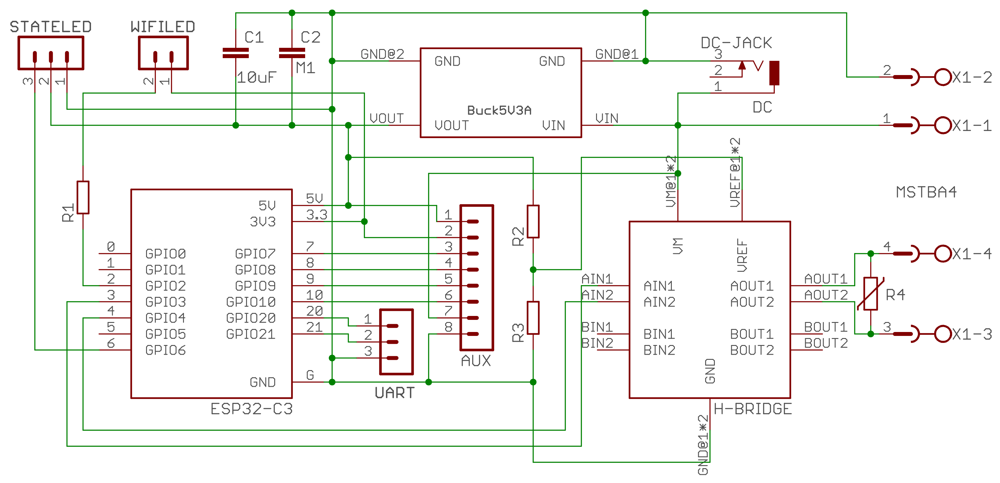
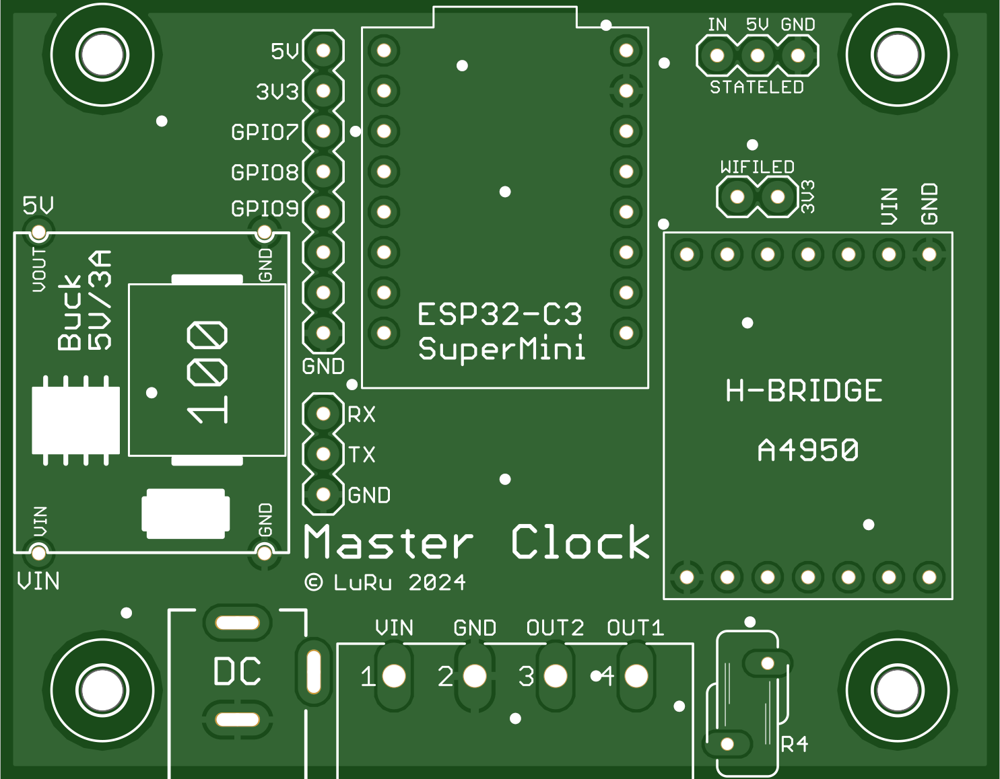
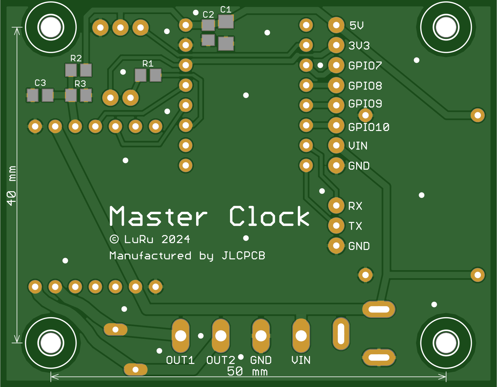
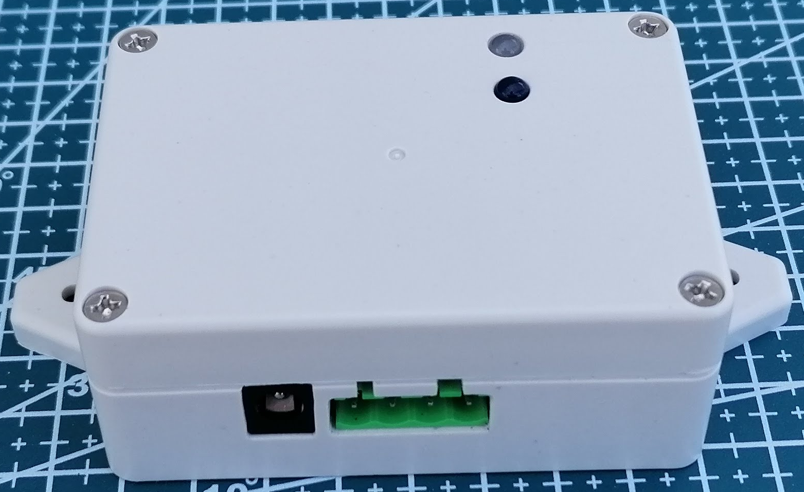
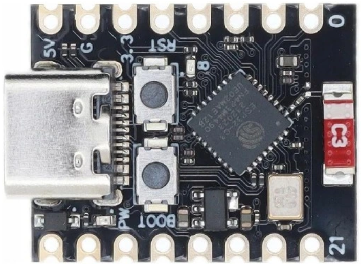
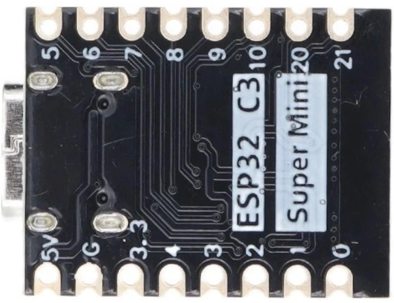
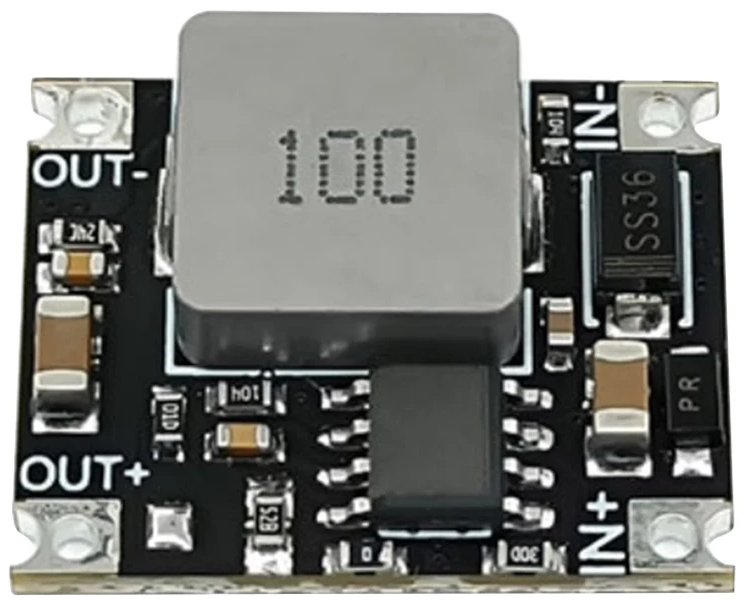
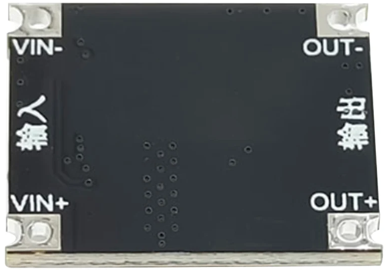
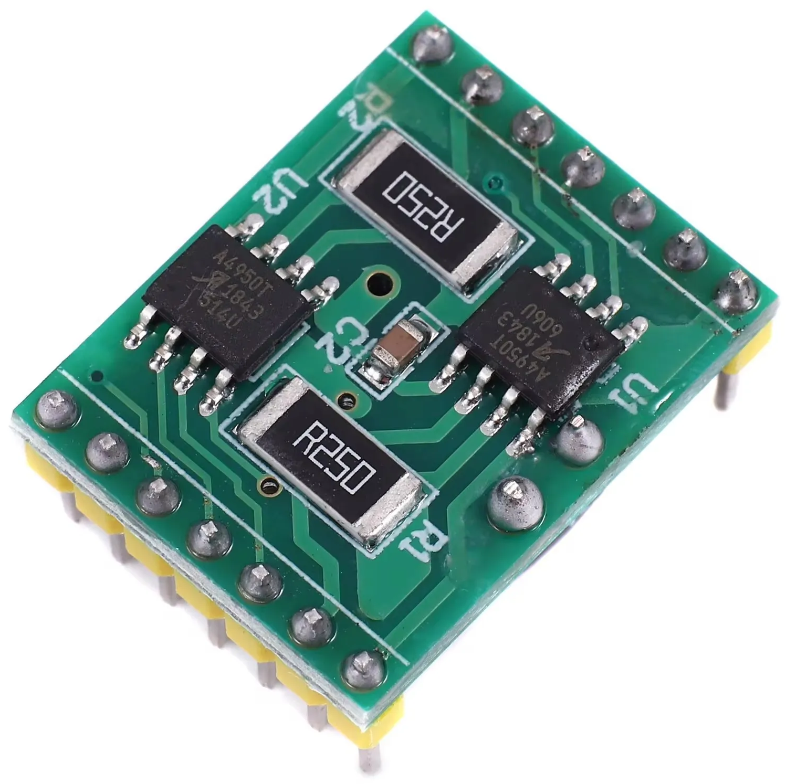
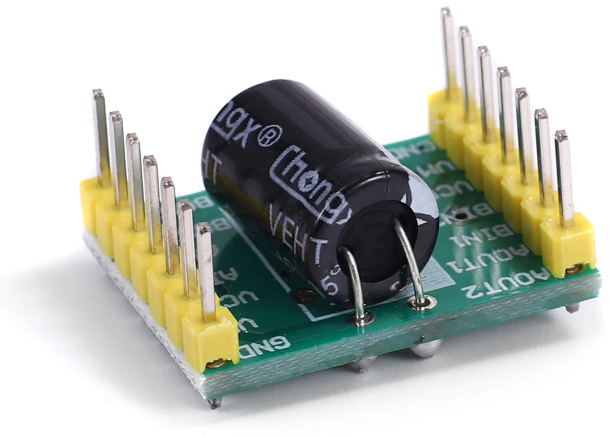

# ESP32_MasterClock
## Introduction
The project addresses the solution of a simple source of polarized pulses for slave clock networks. The precise time is obtained from the internet using the NTP protocol. The heart of the device is the **ESP32-C3 SuperMini** module, which connects to the internet via WiFi. A prerequisite for the proper functioning of the device is, of course, an available WiFi signal at the deployment location.
The distribution of pulses is managed by a module equipped with two **A4950** H-bridges. The design of the module was chosen primarily to ensure easy repair in case of failure. The advantage of the dual configuration is that in the event of a failure of one bridge, it should be sufficient to rotate the module and thus use the second, previously unused bridge.
The device does not contain any adjustment elements or a display. All settings are done through a web interface. The status of the device is indicated using two LEDs. The first LED is used to indicate the status of WiFi (via a steady light or blinking). The second LED is a multi-colored (WS2812) and indicates the status of the slave clock using different colors.

Complete project documentation can be found in the [UserGuide_EN.pdf](doc/UserGuide_EN.pdf) file.

## Design of the device
The wiring diagram and circuit board were created using the Eagle design system.
### Wiring diagram

### Printed circuit board

  
   

### A box
The size of the printed circuit board and the spacing of the mounting holes were adjusted after the design so that the board fits into some - existing on the market - box. A box with dimensions of 83 x 58 x 33 mm fits perfectly.

  
   

## Choice of components
Even before the design started, I was clear that one of the ESP32 chips/modules would be used in the device, and it would be one of the many existing modules to ensure easy replacement in case of failure. In the end, I chose one of the smallest modules – **ESP32-C3 SuperMini**. It is small, cheap and more than adequately equipped for the given use.

  
   

The device is powered by a voltage of 24V, which is required for the correct operation of the slave clock. However, the ESP32-C3 SuperMini module needs a voltage of 5V and therefore a suitable step-down module is used as a power source.

  
   

The selected converter is sufficiently dimensioned both in terms of input voltage (up to 40V) and output current (up to 3A).

One of the most important components of the entire device is the H-bridge, with which polarized pulses are sent to the slave clocks. For this task, I chose the A4950 module equipped with two bridges, but only one of them is used. The second one can (due to the symmetrical design of the module) be considered as a "spare". In case of failure of the first bridge, it is enough to turn the module by 180°.

  
   

### Time
The device obtains the exact time from an NTP server. This requires the ESP32 to be connected to the Internet. A possible failure of Internet connectivity only affects the accuracy of the operation, and after the connection is restored, the synchronization with the NTP server (and thus also the accuracy) is automatically restored.
The transition to DST and back is done automatically (thanks to synchronization with the NTP server).
Sometimes it can happen that none of the known WiFi networks are available when the device is turned on (or restarted). Then, of course, it is not possible to synchronize the time with the NTP server. In such an extreme situation, the **Sync Browser Time to Device** button on the **NTP (Time) Settings** page will help.

### License
The code parts written by the author of the **ESP32_MasterClock** project are licensed under [MIT License](LICENSE), 3rd party libraries that are used by this project are licensed under different license schemes, please check them out as well.

